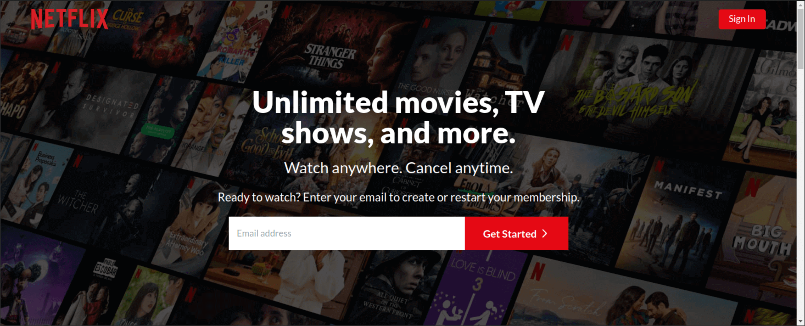

# Netflix Clone App

This project is a clone of netflix.com, a movie streaing web application. I did this project as my final project for the ALX-Frontend Specialization Course to finalize the ALX Software Engineering Program.

#### Technologies:

- HTML
- CSS
- JavaScript
- React
- Tailwind CSS
- Firebase

The application is hosted on firebase and you can find the likn to the live web app below.
[Link to the live web app](https://duckduckgo.com).
